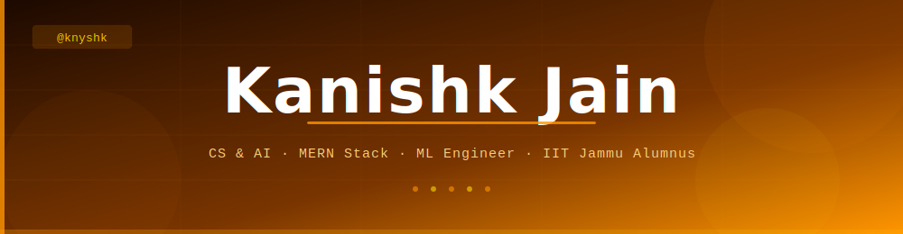

<!--
▓▓▓▓▓▓▓▓▓▓▓▓▓▓▓▓▓▓▓▓▓▓▓▓▓▓▓▓▓▓▓▓▓▓▓▓▓▓▓▓▓▓▓▓▓▓▓▓▓▓▓▓▓▓▓▓▓▓▓▓▓▓▓▓▓▓▓▓▓▓▓
  KANISHK JAIN — github.com/knyshk
▓▓▓▓▓▓▓▓▓▓▓▓▓▓▓▓▓▓▓▓▓▓▓▓▓▓▓▓▓▓▓▓▓▓▓▓▓▓▓▓▓▓▓▓▓▓▓▓▓▓▓▓▓▓▓▓▓▓▓▓▓▓▓▓▓▓▓▓▓▓▓
-->

<!-- ═══════════════════════════════════════════════════════════ -->
<!--  HERO HEADER  — waving type, amber/gold theme             -->
<!-- ═══════════════════════════════════════════════════════════ -->


<!-- ═══════════════════════════════════════════════════════════ -->
<!--  TYPING SVG + BADGES                                       -->
<!-- ═══════════════════════════════════════════════════════════ -->

<div align="center">

<a href="https://github.com/knyshk">
  
</a>

<br/><br/>


&nbsp;

&nbsp;

&nbsp;

&nbsp;


</div>


---

<!-- ═══════════════════════════════════════════════════════════ -->
<!--  CONSOLE BIO                                               -->
<!-- ═══════════════════════════════════════════════════════════ -->

```javascript
// knyshk.config.js — last updated: 2026

const kanishk = {
  name       : "Kanishk Jain",
  handle     : "@knyshk",
  base       : "Alwar, Rajasthan 🇮🇳",
  education  : [
    "B.Tech CS & AI  →  JK Lakshmipat University   (2023 → Present)",
    "Visiting Student →  IIT Jammu   (Jan – May 2025)  ·  DAA · Networks · PPL",
  ],
  focus      : ["Generative AI","MERN Stack", "LLMs", "Reinforcement Learning"],
  building   : ["RAG pipelines", "CV systems", "full-stack apps"],
  scholarship: ["100% Scholarship — Year 1", "75% Scholarship — Year 2"],
  contact    : "kanishk.jain0510@gmail.com",
};

kanishk.run();  //  → open to research · internships · collab
```

---

<!-- ═══════════════════════════════════════════════════════════ -->
<!--  TWO-COLUMN: QUICK FACTS + SOCIALS (all pure HTML)        -->
<!-- ═══════════════════════════════════════════════════════════ -->

<table width="100%" border="0" cellspacing="0" cellpadding="16">
<tr>
<td width="55%" valign="top">

<h3>⚡ &nbsp; Quick Facts</h3>

<ul>
  <li>🏛️ &nbsp; <b>CS &amp; AI</b> undergrad at <b>JKLU</b> + exchange at <b>IIT Jammu</b></li>
  <li>🤖 &nbsp; Deep-diving into <b>LLMs, RAG, RL &amp; Generative AI</b></li>
  <li>🧑‍💻 &nbsp; Ex Full Stack Intern at <b>WebClan.in</b> — MERN end-to-end</li>
  <li>🌐 &nbsp; Portfolio → <a href="https://knyshk-portfolio.netlify.app/"><b>knyshk-portfolio</b></a></li>
  <li>📄 &nbsp; Resume → <a href="https://raw.githubusercontent.com/knyshk/portfolio/src/assets/Kanishk_Jain___CV.pdf"><b>View PDF</b></a></li>
  <li>💬 &nbsp; Ask me about <b>React · Python · LangChain · OpenCV</b></li>
  <li>🌌 &nbsp; Astronomy nerd who codes at night ☕🔭</li>
  <li>📫 &nbsp; <b>kanishk.jain0510@gmail.com</b></li>
</ul>

</td>
<td width="45%" valign="top" align="center">

<h3>🔗 &nbsp; Find Me</h3>
<br/>

<a href="https://www.linkedin.com/in/kanishk-jain-a630b5286/" target="_blank">
  
</a>
<br/><br/>
<a href="https://knyshk-portfolio.netlify.app/" target="_blank">
  
</a>
<br/><br/>
<a href="https://leetcode.com/u/Kanishk0510/" target="_blank">
  
</a>
<br/><br/>
<a href="mailto:kanishk.jain0510@gmail.com" target="_blank">
  
</a>
<br/><br/>
<a href="https://raw.githubusercontent.com/knyshk/portfolio/src/assets/Kanishk_Jain___CV.pdf" target="_blank">
  
</a>

</td>
</tr>
</table>


---

<!-- ═══════════════════════════════════════════════════════════ -->
<!--  TECH STACK                                                -->
<!-- ═══════════════════════════════════════════════════════════ -->

<div align="center">

<h2>🛠 &nbsp; Tech Stack</h2>

<br/>

<b>Languages</b>
<br/><br/>


<br/><br/>
<b>Frameworks &amp; Libraries</b>
<br/><br/>


<br/><br/>
<b>AI / ML / Data</b>
<br/><br/>

&nbsp;


<br/><br/>
<b>Databases &amp; Tools</b>
<br/><br/>


</div>

<br/>

<b>Proficiency Snapshot</b>

<table>
  <tr>
    <td width="160px"><b>Python</b></td>
    <td></td>
  </tr>
  <tr>
    <td><b>React / MERN</b></td>
    <td></td>
  </tr>
  <tr>
    <td><b>C / C++</b></td>
    <td></td>
  </tr>
  <tr>
    <td><b>LangChain / RAG</b></td>
    <td></td>
  </tr>
  <tr>
    <td><b>Computer Vision</b></td>
    <td></td>
  </tr>
  <tr>
    <td><b>SQL / Databases</b></td>
    <td></td>
  </tr>
</table>


---

<!-- ═══════════════════════════════════════════════════════════ -->
<!--  FEATURED PROJECTS (pinned repos + custom cards)          -->
<!-- ═══════════════════════════════════════════════════════════ -->

<h2>🚀 &nbsp; Projects I've Built</h2>

<table width="100%" border="0" cellspacing="0" cellpadding="12">
  <tr>
    <td width="50%" valign="top">
      <a href="https://github.com/knyshk/newscope"><h3>📰 Newscope — AI News Analyst</h3>
      
      
      <br/><br/>
      News analysis system combining RSS scraping, vector DB, and AI-based Q&A. RAG pipeline via LangChain with Gemini + GPT interoperability. Real-time contextual answers via Streamlit.
      <br/><br/>
      
      &nbsp;
      
      
      
      </a>
    </td>
    <td width="50%" valign="top">
      <a href="https://github.com/knyshk/Callix-AI">
      <h3>🤖 Callix AI</h3>
      
      
      <br/><br/>
      AI-powered application built with modern stack. End-to-end intelligent assistant leveraging LLMs for real-world automation and interaction workflows.
      <br/><br/>
      
      &nbsp;
      
      </a>
    </td>
  </tr>
  <tr>
    <td width="50%" valign="top">
      <a href="https://github.com/knyshk/Driver-Drowsiness-Detection-System">
      <h3>😴 Driver Drowsiness Detection</h3>
      
      
      <br/><br/>
      Real-time fatigue detection via CNN-based eye &amp; mouth analysis with MediaPipe facial landmarks. Integrated alert system for blink + yawn detection. Potential life-saving safety tool.
      <br/><br/>
      
      &nbsp;
      
      
      </a>
    </td>
    <td width="50%" valign="top">
      <a href="https://github.com/knyshk/SVD-Based-Image-Steganography">
      <h3>🔐 SVD Image Steganography</h3>
      
      
      <br/><br/>
      Deterministic text-in-image hiding using Singular Value Decomposition on the blue channel. Non-blind extraction via structured NumPy indexing. Zero third-party stego libraries.
      <br/><br/>
      
      &nbsp;
      
      
      
      </a>
    </td>
  </tr>
</table>


---

<!-- ═══════════════════════════════════════════════════════════ -->
<!--  EXPERIENCE & EDUCATION (pure HTML)                       -->
<!-- ═══════════════════════════════════════════════════════════ -->

<h2>🧑‍💻 &nbsp; Experience &amp; Education</h2>

<table width="100%" border="0" cellspacing="0" cellpadding="10">
  <tr>
    <td width="50px" align="center" valign="top">💼</td>
    <td valign="top">
      <b>Full Stack Development Intern</b> — <a href="https://webclan.in">WebClan.in</a>
      &nbsp;
      <br/>
      <sub>Built a full-scale MERN stack application end-to-end · Frontend, Backend, Database &amp; Deployment · Solo ownership across the entire stack</sub>
    </td>
  </tr>
  <tr>
    <td width="50px" align="center" valign="top">🏛️</td>
    <td valign="top">
      <b>Visiting Student — B.Tech CS &amp; Engineering</b> — <a href="https://iitjammu.ac.in">IIT Jammu</a>
      &nbsp;
      <br/>
      <sub>Semester Exchange · Design &amp; Analysis of Algorithms · Computer Networks · Principles of Programming Languages</sub>
    </td>
  </tr>
  <tr>
    <td width="50px" align="center" valign="top">🎓</td>
    <td valign="top">
      <b>B.Tech — Computer Science &amp; AI</b> — <a href="https://jklu.edu.in">JK Lakshmipat University</a>
      &nbsp;
      <br/>
      <sub>CGPA: 7.46 · 100% Merit Scholarship (Year 1) · 75% Merit Scholarship (Year 2) · Astronomy Club · Event Coordinator SABRANG'23</sub>
    </td>
  </tr>
</table>


---

<!-- ═══════════════════════════════════════════════════════════ -->
<!--  CONTRIBUTION GRAPH                                        -->
<!-- ═══════════════════════════════════════════════════════════ -->

<div align="center">

<h2>📈 &nbsp; Contribution Activity</h2>

<br/>


</div>

<br/>


---

<!-- ═══════════════════════════════════════════════════════════ -->
<!--  CONTRIBUTION SNAKE                                        -->
<!--  Activate: push snake.yml to .github/workflows/           -->
<!-- ═══════════════════════════════════════════════════════════ -->

<!-- ═══════════════════════════════════════════════════════════ -->
<!--  CONTRIBUTION HEATMAP                                      -->
<!-- ═══════════════════════════════════════════════════════════ -->

<div align="center">
 
<h2>🗓 &nbsp; Contribution Heatmap</h2>
 
<br/>
 
<!-- Dynamic heatmap with auto-refresh -->

 
</div>
 
<br/>

<!-- ═══════════════════════════════════════════════════════════ -->
<!--  PROFILE SUMMARY CARDS                                     -->
<!-- ═══════════════════════════════════════════════════════════ -->

<div align="center">

<h2>🗂 &nbsp; Profile Summary</h2>

<br/>


<br/>


&nbsp;

&nbsp;


</div>

<br/>


---

<!-- ═══════════════════════════════════════════════════════════ -->
<!--  ACHIEVEMENTS & CERTS                                      -->
<!-- ═══════════════════════════════════════════════════════════ -->

<h2>🏅 &nbsp; Achievements &amp; Certifications</h2>

<table width="100%" border="0" cellspacing="0" cellpadding="8">
  <tr>
    <td width="30px">🏛️</td>
    <td><b>Semester Exchange @ IIT Jammu</b> — DAA · Computer Networks · Principles of Programming Languages · Jan–May 2025</td>
  </tr>
  <tr>
    <td>💰</td>
    <td><b>100% Merit Scholarship</b> — Year 1 @ JKLU &nbsp;|&nbsp; <b>75% Merit Scholarship</b> — Year 2 @ JKLU</td>
  </tr>
  <tr>
    <td>🏅</td>
    <td><b>AI Vicharana Shala</b> — IIT Ropar AI Bootcamp · Intensive hands-on AI program</td>
  </tr>
  <tr>
    <td>📜</td>
    <td><b>Python Programming</b> — University of Michigan via Coursera</td>
  </tr>
  <tr>
    <td>📜</td>
    <td><b>Crash Course on Python</b> — Google via Coursera &nbsp;|&nbsp; <b>C Programming</b> — Infosys Springboard</td>
  </tr>
  <tr>
    <td>📜</td>
    <td><b>Intro to Web Development</b> — IBM via Coursera &nbsp;|&nbsp; <b>C for Everyone</b> — UC Santa Cruz via Coursera</td>
  </tr>
  <tr>
    <td>⚙️</td>
    <td><b>Event Coordinator, SABRANG'23</b> — GK Quiz Event, JK Lakshmipat University</td>
  </tr>
  <tr>
    <td>🔭</td>
    <td><b>Event Coordinator, Nakshatra Club</b> — Stargazing sessions &amp; astronomy discussions · Sep 2023 – Apr 2024</td>
  </tr>
</table>


---

<!-- ═══════════════════════════════════════════════════════════ -->
<!--  THE HUMAN SIDE                                            -->
<!-- ═══════════════════════════════════════════════════════════ -->

<h2>🌌 &nbsp; Beyond the Terminal</h2>

> I'm not just the person who writes the code — I'm also the one staring at the night sky wondering why the universe bothers.

```yaml
hobbies:
  sport:        [Basketball, Badminton, Table Tennis, Chess ♟️]
  creative:     [Photography 📷, Reading Sci-Fi & Biographies 📚]
  intellectual: [Competitive Programming, Astronomy & Stargazing 🔭]

currently_reading:    "Something with a good plot twist"
favourite_sky_object: "Orion Nebula — basically a star factory"
chess_style:          "Aggressive openings, questionable middlegames, somehow wins"
coding_hours:         "11pm → 2am  (classic)"
```


---

<!-- ═══════════════════════════════════════════════════════════ -->
<!--  FOOTER                                                    -->
<!-- ═══════════════════════════════════════════════════════════ -->

<div align="center">

<br/>


<br/><br/>

⭐ <b>If something here helped you, a star goes a long way!</b> ⭐

<br/>

</div>


